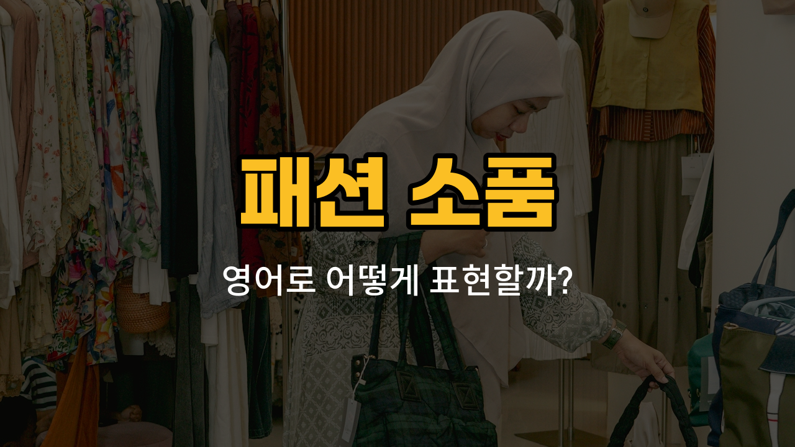

패션을 완성하는 데 빠질 수 없는 소품들! 오늘은 모자, 목도리, 장갑, 벨트, 시계 등 일상에서 자주 쓰는 패션 소품들의 영어 표현을 배워볼 거예요. 각각의 단어와 예문을 통해 실제로 어떻게 쓰이는지도 함께 익혀보세요.

## 1. 모자 (Hat)

햇빛을 가리거나 스타일을 더할 때 쓰는 머리에 쓰는 소품이에요.

### 🗣️ 발음

- 발음기호: /hæt/
- 한국어 발음: 햇

### 💭 관련 표현

- baseball hat: 야구 모자
- winter hat: 겨울 모자
- sun hat: 썬햇, 챙 넓은 모자

### 📝 예문으로 연습하기!

1. "She wore a [red](/blog/in-english/1381.red/) hat to the [party](/blog/in-english/1212.party/)."

   "그녀는 파티에 빨간 모자를 썼어요."

2. "Don’t [forget](/blog/in-english/023.forget/) your hat, it’s sunny outside."

   "모자 잊지 마세요, 밖에 해가 쨍쨍해요."

## 2. 목도리 (Scarf)

목을 따뜻하게 하거나 멋을 더할 때 두르는 천이에요.

### 🗣️ 발음

- 발음기호: /skɑːrf/
- 한국어 발음: 스카프

### 💭 관련 표현

- wool scarf: 울 목도리
- silk scarf: 실크 목도리
- long scarf: 긴 목도리

### 📝 예문으로 연습하기!

1. "I [bought](/blog/in-english/1287.buy/) a new scarf for winter."

   "겨울을 위해 새 목도리를 샀어요."

2. "Her scarf matches her coat."

   "그녀의 목도리가 코트와 잘 어울려요."

## 3. 장갑 (Gloves)

손을 따뜻하게 하거나 보호할 때 끼는 소품이에요.

### 🗣️ 발음

- 발음기호: /ɡlʌvz/
- 한국어 발음: 글러브즈

### 💭 관련 표현

- leather gloves: 가죽 장갑
- winter gloves: 겨울 장갑
- driving gloves: 운전용 장갑

### 📝 예문으로 연습하기!

1. "Don’t forget your gloves in the cold [weather](/blog/in-english/1437.weather/)."

   "추운 날씨에는 장갑 꼭 챙기세요."

2. "He wore [black](/blog/in-english/1217.black/) gloves to the event."

   "그는 행사에 검은 장갑을 꼈어요."

## 4. 벨트 (Belt)

바지나 치마가 흘러내리지 않게 허리에 차는 소품이에요.

### 🗣️ 발음

- 발음기호: /belt/
- 한국어 발음: 벨트

### 💭 관련 표현

- leather belt: 가죽 벨트
- black belt: 검은 벨트
- fashion belt: 패션 벨트

### 📝 예문으로 연습하기!

1. "My belt is too tight."

   "제 벨트가 너무 꽉 껴요."

2. "He bought a new belt for his pants."

   "그는 바지에 맞는 새 벨트를 샀어요."

## 5. 시계 (Watch)

손목에 차는 소품으로, 시간을 볼 수 있어요.

### 🗣️ 발음

- 발음기호: /wɑːtʃ/
- 한국어 발음: 와치

### 💭 관련 표현

- wrist [watch](/blog/in-english/1352.watch/): 손목시계
- digital watch: 디지털 시계
- smart watch: 스마트워치

### 📝 예문으로 연습하기!

1. "What time is it on your watch?"

   "당신 시계로 지금 몇 시예요?"

2. "She got a watch for her birthday."

   "그녀는 생일 선물로 시계를 받았어요."

---

이렇게 오늘은 패션 소품에 대해 영어 단어와 예문을 배워봤어요. 오늘 배운 단어들을 직접 말해보고, 내 패션 소품을 영어로 설명하는 연습을 해보세요! 다음에 또 만나요~
