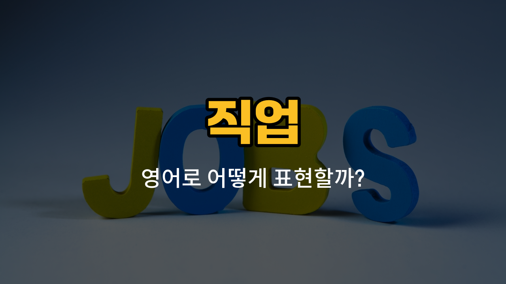

오늘은 다양한 직업을 영어로 어떻게 표현하는지 알아볼 거예요. "요리사(chef)", "운동선수(athlete)", "가수(singer)", "배우(actor)", "화가(painter)"와 같은 직업 이름을 영어로 말하는 법과 함께, 예문으로도 연습해볼게요. 발음, 관련 표현, 예문까지 꼼꼼히 익혀보세요!

## 1. 요리사 (Chef)

음식점이나 호텔 등에서 음식을 만드는 일을 전문적으로 하는 사람이에요.

### 🗣️ 발음

- 발음기호: /ʃɛf/
- 한국어 발음: 셰프

### 💭 관련 표현

- [head](/blog/in-english/1211.head/) chef: 주방장
- pastry chef: 제과 셰프
- sous chef: 부주방장

### 📝 예문으로 연습하기!

1. "My dream is to become a chef."

   "제 꿈은 요리사가 되는 거예요."

2. "The chef prepared a delicious [meal](/blog/in-english/528.meal/)."

   "셰프가 맛있는 식사를 준비했어요."

## 2. 운동선수 (Athlete)

운동을 직업으로 하며, 경기나 대회에 참가하는 사람이에요.

### 🗣️ 발음

- 발음기호: /ˈæθ.liːt/
- 한국어 발음: 애슬릿

### 💭 관련 표현

- professional athlete: 프로 운동선수
- Olympic athlete: 올림픽 선수
- track athlete: 육상 선수

### 📝 예문으로 연습하기!

1. "She is a famous athlete in Korea."

   "그녀는 한국에서 유명한 운동선수예요."

2. "Many athletes train every [day](/blog/in-english/1067.day/)."

   "많은 운동선수들이 매일 훈련해요."

## 3. 가수 (Singer)

노래를 부르는 것을 직업으로 하는 사람이에요.

### 🗣️ 발음

- 발음기호: /ˈsɪŋ.ər/
- 한국어 발음: 싱어

### 💭 관련 표현

- pop singer: 팝 가수
- lead singer: 리드 보컬
- opera singer: 오페라 가수

### 📝 예문으로 연습하기!

1. "He [wants](/blog/in-english/1060.want/) to be a singer."

   "그는 가수가 되고 싶어해요."

2. "The singer has a beautiful voice."

   "그 가수는 목소리가 정말 아름다워요."

## 4. 배우 (Actor)

영화, 드라마, 연극 등에서 연기를 하는 사람이에요.

### 🗣️ 발음

- 발음기호: /ˈæk.tər/
- 한국어 발음: 액터

### 💭 관련 표현

- movie actor: 영화 배우
- stage actor: 무대 배우
- lead actor: 주연 배우

### 📝 예문으로 연습하기!

1. "My brother is an actor."

   "제 남동생은 배우예요."

2. "The actor [played](/blog/in-english/1081.play/) the [main](/blog/in-english/1404.main/) character."

   "그 배우가 주인공 역할을 했어요."

## 5. 화가 (Painter)

그림을 그리고, 예술 작품을 만드는 사람이에요.

### 🗣️ 발음

- 발음기호: /ˈpeɪn.tər/
- 한국어 발음: 페인터

### 💭 관련 표현

- famous painter: 유명한 화가
- portrait painter: 초상화 화가
- landscape painter: 풍경화가

### 📝 예문으로 연습하기!

1. "She is a talented painter."

   "그녀는 재능 있는 화가예요."

2. "The painter is [working on](/blog/in-english/370.work-on/) a new piece."

   "화가가 새로운 작품을 그리고 있어요."

---

오늘 배운 직업 이름들을 소리내어 따라해보고, 예문도 여러 번 연습해보세요! 직업을 영어로 자연스럽게 말할 수 있게 될 거예요. 다음에도 더 유용한 영어 단어로 찾아올게요~
