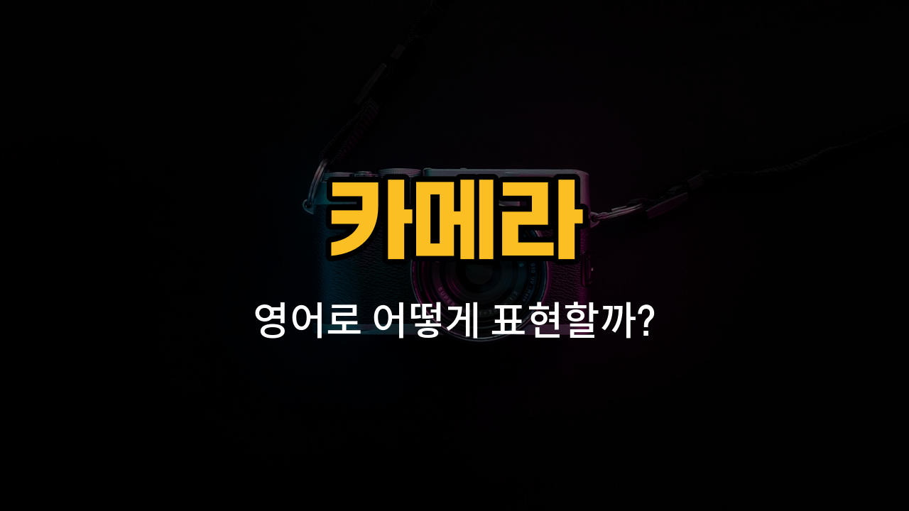

사진을 찍을 때 카메라에서 자주 볼 수 있는 부품들의 영어 표현을 알아볼게요! 오늘은 렌즈캡, 뷰파인더, 셔터 버튼, 조리개, 삼각대 구멍과 같은 실제 카메라 부품 이름을 영어로 어떻게 말하는지, 그리고 각 단어의 의미와 예문을 함께 공부해요.

## 1. 렌즈캡 (Lens Cap)

렌즈를 먼지나 흠집으로부터 보호해주는 뚜껑이에요. 사진을 찍지 않을 때는 꼭 씌워두는 게 좋아요.

### 🗣️ 발음
- 발음기호: /lɛnz kæp/
- 한국어 발음: 렌즈 캡

### 💭 관련 표현
- put on the lens cap: 렌즈캡을 씌우다
- lose the lens cap: 렌즈캡을 잃어버리다

### 📝 예문으로 연습하기!
1. "Don't forget to put the lens cap back on after [taking](/blog/in-english/1328.taking/) photos."

   "사진을 찍고 나서 꼭 렌즈캡을 다시 씌우는 걸 잊지 마세요."

2. "I [lost](/blog/in-english/1356.lost/) my lens cap during the [trip](/blog/in-english/1150.trip/)."

   "여행 중에 렌즈캡을 잃어버렸어요."

## 2. 뷰파인더 (Viewfinder)

카메라로 사진을 찍을 때 눈으로 직접 보는 작은 창이에요. 이 창을 통해 구도를 맞춰요.

### 🗣️ 발음
- 발음기호: /ˈvjuːˌfaɪndər/
- 한국어 발음: 뷰파인더

### 💭 관련 표현
- look through the viewfinder: 뷰파인더로 들여다보다
- adjust the viewfinder: 뷰파인더를 조절하다

### 📝 예문으로 연습하기!
1. "She looked through the viewfinder to frame the picture."

   "그녀는 사진 구도를 잡으려고 뷰파인더로 들여다봤어요."

2. "The viewfinder [helps](/blog/in-english/1084.help/) you focus on your subject."

   "뷰파인더는 피사체에 집중하는 데 도움이 돼요."

## 3. 셔터 버튼 (Shutter Button)

사진을 찍을 때 누르는 버튼이에요. 이 버튼을 누르면 사진이 찍혀요.

### 🗣️ 발음
- 발음기호: /ˈʃʌtər ˈbʌtn/
- 한국어 발음: 셔터 버튼

### 💭 관련 표현
- press the shutter button: 셔터 버튼을 누르다
- half-press the shutter button: 셔터 버튼을 반쯤 누르다

### 📝 예문으로 연습하기!
1. "Press the shutter button to take a photo."

   "사진을 찍으려면 셔터 버튼을 누르세요."

2. "I [accidentally](/blog/in-english/314.accidentally/) pressed the shutter button."

   "실수로 셔터 버튼을 눌러버렸어요."

## 4. 조리개 (Aperture)

카메라 렌즈 안에서 빛이 들어오는 양을 조절하는 부분이에요. 조리개를 조이면 배경이 더 흐려져요.

### 🗣️ 발음
- 발음기호: /ˈæpərtʃər/
- 한국어 발음: 애퍼처

### 💭 관련 표현
- adjust the aperture: 조리개를 조절하다
- wide aperture: 넓은 조리개

### 📝 예문으로 연습하기!
1. "A wide aperture lets in more [light](/blog/in-english/1373.light/)."

   "넓은 조리개는 더 많은 빛을 들어오게 해요."

2. "You can adjust the aperture for different effects."

   "다양한 효과를 위해 조리개를 조절할 수 있어요."

## 5. 삼각대 구멍 (Tripod Socket)

카메라 하단에 있는, 삼각대와 연결하는 구멍이에요. 삼각대를 사용할 때 꼭 필요해요.

### 🗣️ 발음
- 발음기호: /ˈtraɪpɑːd ˈsɑːkɪt/
- 한국어 발음: 트라이팟 소켓

### 💭 관련 표현
- attach to the tripod socket: 삼각대 구멍에 연결하다
- tighten the tripod socket: 삼각대 구멍을 조이다

### 📝 예문으로 연습하기!
1. "Screw the tripod into the tripod socket."

   "삼각대를 삼각대 구멍에 돌려서 끼워요."

2. "Check that the tripod socket is [secure](/blog/in-english/492.secure/)."

   "삼각대 구멍이 잘 고정됐는지 확인해요."

---

이렇게 카메라의 주요 부품 영어 단어와 예문을 정리해봤어요! 오늘 배운 단어들을 직접 카메라를 보면서 소리내어 따라해보면 더 쉽게 외울 수 있어요. 다음에도 더 실용적인 영어 단어로 돌아올게요~
