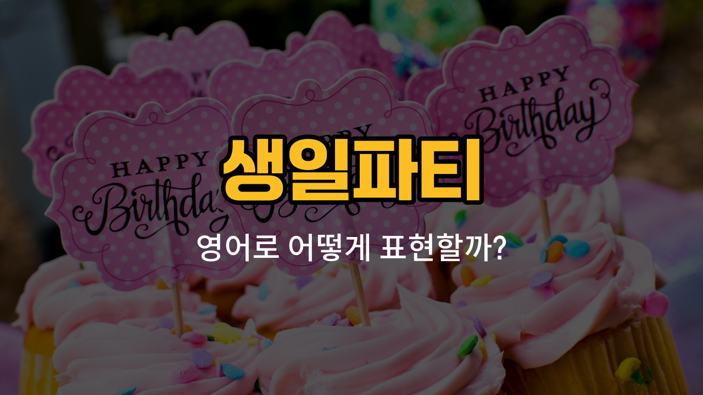

생일파티를 준비할 때 빠질 수 없는 필수 아이템들이 있어요! 오늘은 생일파티에서 자주 쓰이는 물건들의 영어 표현을 배워볼 거예요. 각 단어의 발음과 함께 예문도 연습해 보세요. 생일파티 영어 대화가 훨씬 쉬워질 거예요.

## 1. 초 (Candle)

생일케이크 위에 꽂아서 소원을 빌며 끄는 작은 불이에요.

### 🗣️ 발음

- 발음기호: /ˈkændl/
- 한국어 발음: 캔들

### 💭 관련 표현

- birthday candle: 생일 초
- [light](/blog/in-english/1373.light/) a candle: 초에 불을 붙이다

### 📝 예문으로 연습하기!

1. "She blew out the candle on her birthday cake."

   "그녀는 생일케이크 위의 초를 불어서 껐어요."

2. "Don’t [forget](/blog/in-english/023.forget/) to light the candle before singing!"

   "노래 부르기 전에 초에 불 붙이는 거 잊지 마세요!"

## 2. 생일케이크 (Birthday cake)

생일을 축하할 때 빠질 수 없는 달콤한 케이크예요.

### 🗣️ 발음

- 발음기호: /ˈbɜːrθ.deɪ keɪk/
- 한국어 발음: 벌스데이 케이크

### 💭 관련 표현

- chocolate birthday cake: 초콜릿 생일케이크
- make a birthday cake: 생일케이크를 만들다

### 📝 예문으로 연습하기!

1. "We [bought](/blog/in-english/1287.buy/) a big birthday cake for my [sister](/blog/in-english/1428.sister/)."

   "우리는 여동생을 위해 큰 생일케이크를 샀어요."

2. "The birthday cake was decorated with strawberries."

   "생일케이크에는 딸기가 장식되어 있었어요."

## 3. 풍선 (Balloon)

파티 분위기를 살려주는 색색의 공기 풍선이에요.

### 🗣️ 발음

- 발음기호: /bəˈluːn/
- 한국어 발음: 벌룬

### 💭 관련 표현

- blow up a balloon: 풍선을 불다
- colorful balloons: 알록달록한 풍선들

### 📝 예문으로 연습하기!

1. "We decorated the room with balloons."

   "우리는 풍선으로 방을 꾸몄어요."

2. "Can you [help](/blog/in-english/1084.help/) me blow up these balloons?"

   "이 풍선들 불어주는 거 도와줄 수 있어요?"

## 4. 축하 카드 (Greeting card)

생일을 축하하는 메시지를 적어 주는 카드예요.

### 🗣️ 발음

- 발음기호: /ˈɡriː.tɪŋ kɑːrd/
- 한국어 발음: 그리팅 카드

### 💭 관련 표현

- write a greeting card: 축하 카드를 쓰다
- birthday greeting card: 생일 축하 카드

### 📝 예문으로 연습하기!

1. "I wrote a sweet message in the greeting card."

   "축하 카드에 달콤한 메시지를 썼어요."

2. "She [gave](/blog/in-english/1407.gave/) me a beautiful greeting card."

   "그녀가 저에게 예쁜 축하 카드를 줬어요."

## 5. 파티모자 (Party hat)

생일파티에서 머리에 쓰는 알록달록한 모자예요.

### 🗣️ 발음

- 발음기호: /ˈpɑːr.ti hæt/
- 한국어 발음: 파티 햇

### 💭 관련 표현

- wear a [party](/blog/in-english/1212.party/) hat: 파티모자를 쓰다
- colorful party hats: 알록달록한 파티모자들

### 📝 예문으로 연습하기!

1. "Everyone wore a party hat at the party."

   "파티에서 모두가 파티모자를 썼어요."

2. "Don’t forget to bring your party hat!"

   "파티모자 꼭 챙겨오세요!"

---

오늘 배운 생일파티 관련 영어 단어, 꼭 소리내어 여러 번 연습해보세요! 다음 파티 때 직접 써보면 더 기억에 잘 남아요. 다음에도 더 재미있고 실용적인 영어 단어로 돌아올게요~
