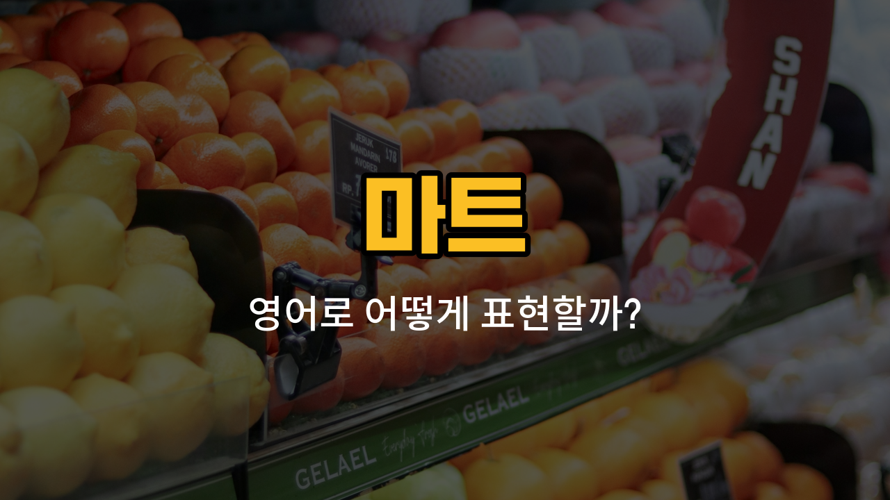

마트에서 자주 사용하는 영어 단어들을 알아볼게요! 오늘은 계산대(checkout), 장바구니(shopping basket), 카트(cart), 영수증([receipt](/blog/in-english/526.receipt/)), 포장지(wrapping paper)라는 단어들을 배워볼 거예요. 마트에서 장을 볼 때 꼭 필요한 단어들이니 차근차근 익혀보세요.

## 1. 계산대 (checkout)

계산대는 마트에서 물건을 계산하는 곳이에요. 영어로는 checkout이라고 해요.

### 🗣️ 발음
- 발음기호: /ˈtʃek.aʊt/
- 한국어 발음: 체크아웃

### 💭 관련 표현
- checkout counter: 계산대
- [self](/blog/in-english/1416.self/)-checkout: 셀프 계산대

### 📝 예문으로 연습하기!

1. "[Let](/blog/in-english/1112.let/)’s go to the checkout."

   "계산대로 가요."

2. "There’s a long [line](/blog/in-english/1234.line/) at the checkout."

   "계산대에 줄이 길어요."

## 2. 장바구니 (shopping basket)

마트에서 물건을 담을 때 사용하는 작은 바구니를 영어로 shopping basket이라고 해요.

### 🗣️ 발음
- 발음기호: /ˈʃɑː.pɪŋ ˈbæs.kɪt/
- 한국어 발음: 쇼핑 배스킷

### 💭 관련 표현
- plastic basket: 플라스틱 바구니
- [hand](/blog/in-english/1239.hand/) basket: 손으로 드는 바구니

### 📝 예문으로 연습하기!

1. "Can you grab a shopping basket?"

   "장바구니 하나 가져다줄래요?"

2. "My shopping basket is full."

   "제 장바구니가 가득 찼어요."

## 3. 카트 (cart)

많은 물건을 담을 수 있는 큰 바퀴 달린 바구니를 영어로 cart라고 해요.

### 🗣️ 발음
- 발음기호: /kɑːrt/
- 한국어 발음: 카트

### 💭 관련 표현
- shopping cart: 쇼핑 카트
- push the cart: 카트를 밀다

### 📝 예문으로 연습하기!

1. "Please put the heavy items in the cart."

   "무거운 물건은 카트에 넣어주세요."

2. "I [found](/blog/in-english/1094.found/) a cart near the entrance."

   "입구 근처에서 카트를 찾았어요."

## 4. 영수증 (receipt)

구매한 물건의 내역과 금액이 적힌 종이를 영어로 receipt라고 해요.

### 🗣️ 발음
- 발음기호: /rɪˈsiːt/
- 한국어 발음: 리싯

### 💭 관련 표현
- print a receipt: 영수증을 출력하다
- keep the receipt: 영수증을 보관하다

### 📝 예문으로 연습하기!

1. "Don’t [forget](/blog/in-english/023.forget/) to take your receipt."

   "영수증 챙기는 것 잊지 마세요."

2. "Can I get a receipt, please?"

   "영수증 받을 수 있을까요?"

## 5. 포장지 (wrapping paper)

선물이나 물건을 예쁘게 싸는 데 사용하는 종이를 영어로 wrapping paper라고 해요.

### 🗣️ 발음
- 발음기호: /ˈræp.ɪŋ ˈpeɪ.pər/
- 한국어 발음: 래핑 페이퍼

### 💭 관련 표현
- gift wrapping paper: 선물 포장지
- colorful wrapping paper: 알록달록한 포장지

### 📝 예문으로 연습하기!

1. "I need some wrapping paper for this gift."

   "이 선물을 포장할 포장지가 필요해요."

2. "The store sells beautiful wrapping paper."

   "그 가게는 예쁜 포장지를 팔아요."

---

마트에서 꼭 필요한 영어 단어들을 배워봤어요! 오늘 배운 단어와 예문들을 여러 번 소리내어 연습해보세요. 다음에 더 유용한 영어 단어로 돌아올게요~
