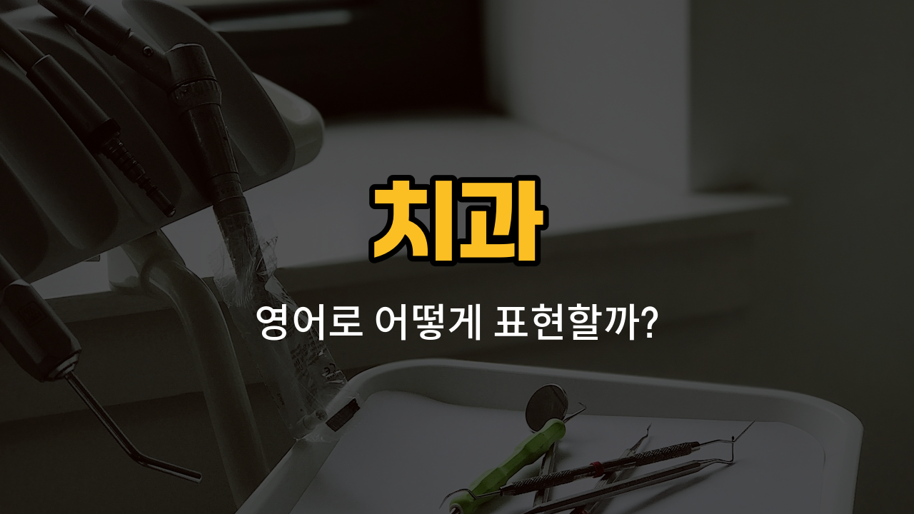

치과에 가면 자주 듣게 되는 신체 부위 영어 단어들이 있어요. 오늘은 송곳니, 혀, 입천장, 턱, 치근의 영어 표현을 배워볼 거예요. 발음, 의미 설명, 그리고 실생활에서 쓸 수 있는 예문까지 함께 익혀보세요!

## 1. 송곳니 (Canine)

송곳니는 앞니와 어금니 사이에 있는 뾰족한 이빨이에요. 고기를 찢거나 자르는 데 중요한 역할을 해요.

### 🗣️ 발음

- 발음기호: /ˈkeɪ.naɪn/
- 한국어 발음: 케이나인

### 💭 관련 표현

- upper canine: 위쪽 송곳니
- lower canine: 아래쪽 송곳니

### 📝 예문으로 연습하기!

1. "My [left](/blog/in-english/1106.left/) canine is very [sensitive to](/blog/in-english/780.sensitive-to/) cold."

   "왼쪽 송곳니가 차가운 것에 아주 민감해요."

2. "The dentist checked my canine for cavities."

   "치과 의사 선생님이 송곳니에 충치가 있는지 확인했어요."

## 2. 혀 (Tongue)

혀는 입 안에 있는 근육 조직으로, 맛을 느끼고 말을 하거나 음식을 씹는 데 꼭 필요해요.

### 🗣️ 발음

- 발음기호: /tʌŋ/
- 한국어 발음: 텅

### 💭 관련 표현

- tip of the tongue: 혀끝
- stick out your tongue: 혀를 내밀다

### 📝 예문으로 연습하기!

1. "Please stick out your tongue."

   "혀를 내밀어 주세요."

2. "I [bit](/blog/in-english/1309.bit/) my tongue while eating."

   "밥 먹다가 혀를 깨물었어요."

## 3. 입천장 (Palate)

입천장은 입의 위쪽 부분, 즉 천장 부분을 말해요. 음식의 온도나 질감을 느끼는 데 중요한 역할을 해요.

### 🗣️ 발음

- 발음기호: /ˈpæl.ət/
- 한국어 발음: 팰럿

### 💭 관련 표현

- hard palate: 경구개(딱딱한 입천장)
- soft palate: 연구개(부드러운 입천장)

### 📝 예문으로 연습하기!

1. "The roof of your mouth is [called](/blog/in-english/1114.called/) the palate."

   "입의 천장은 입천장이라고 해요."

2. "Hot [food](/blog/in-english/1308.food/) can burn your palate."

   "뜨거운 음식을 먹으면 입천장을 데일 수 있어요."

## 4. 턱 (Jaw)

턱은 이가 붙어있는 얼굴의 아래쪽 뼈 부분이에요. 음식을 씹고 말을 하는 데 중요한 역할을 해요.

### 🗣️ 발음

- 발음기호: /dʒɔː/
- 한국어 발음: 조

### 💭 관련 표현

- lower jaw: 아래턱
- upper jaw: 위턱

### 📝 예문으로 연습하기!

1. "My jaw hurts when I chew."

   "씹을 때 턱이 아파요."

2. "He has a strong jawline."

   "그 사람은 턱선이 뚜렷해요."

## 5. 치근 (Tooth root)

치근은 치아의 뿌리 부분으로, 잇몸 속에 박혀 있어 치아를 단단히 고정해 줘요.

### 🗣️ 발음

- 발음기호: /tuːθ ruːt/
- 한국어 발음: 투스 루트

### 💭 관련 표현

- exposed tooth root: 노출된 치근
- tooth root canal: 치근관

### 📝 예문으로 연습하기!

1. "The dentist [said](/blog/in-english/1061.said/) my tooth root is [healthy](/blog/in-english/1290.healthy/)."

   "치과 선생님이 제 치근이 건강하다고 하셨어요."

2. "A damaged tooth root can cause pain."

   "치근이 손상되면 통증이 생길 수 있어요."

---

오늘 배운 단어들은 치과 진료나 영어로 건강 상담을 할 때 정말 유용해요! 여러 번 소리내어 따라 읽어보고, 실제 상황에서 써보려고 노력해 보세요. 다음에도 실생활에 도움이 되는 영어 단어로 찾아올게요~
