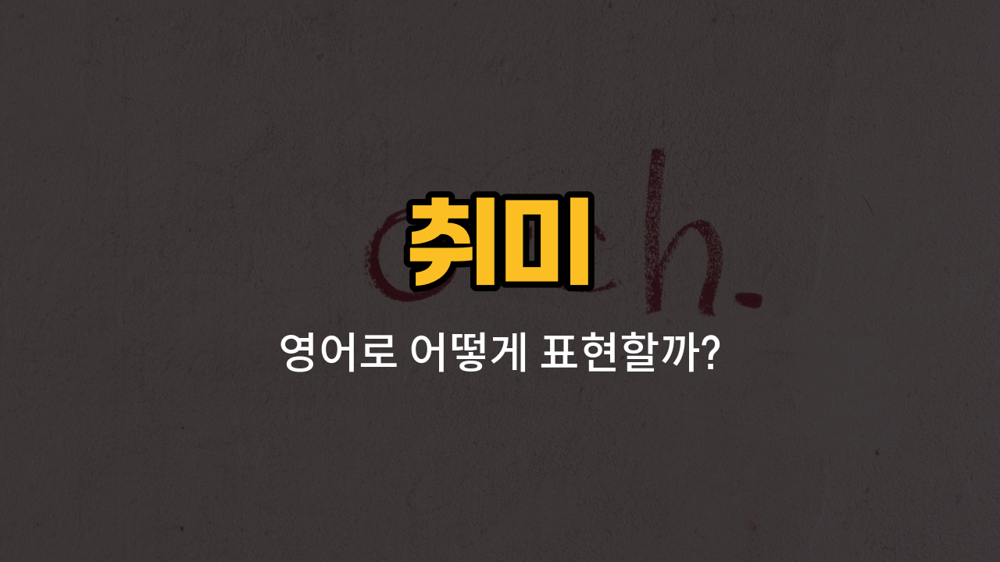

취미 생활을 영어로 이야기할 때 자주 쓰는 단어들을 알아볼게요! 오늘은 낚시, 사진 찍기, 그림 그리기, 악기 연주, 춤추기와 관련된 영어 단어들을 배워보고, 각각의 단어가 실제로 어떻게 쓰이는지도 예문과 함께 익혀볼 거예요. 영어로 내 취미를 자연스럽게 소개하고 싶다면 꼭 알아두세요!

## 1. 낚시 (Fishing)

물고기를 잡는 활동이에요. 자연에서 여유롭게 즐길 수 있는 취미 중 하나죠.

### 🗣️ 발음
- 발음기호: /ˈfɪʃɪŋ/
- 한국어 발음: 피싱

### 💭 관련 표현
- go fishing: 낚시하러 가다
- fishing rod: 낚싯대
- fishing spot: 낚시터

### 📝 예문으로 연습하기!

1. "I like [to go](/blog/in-english/450.to-go/) fishing on weekends."

   "저는 주말마다 낚시하러 가는 걸 좋아해요."

2. "He caught a big fish while fishing yesterday."

   "그는 어제 낚시하다가 큰 물고기를 잡았어요."

## 2. 사진 찍기 (Photography)

카메라로 순간을 기록하는 취미예요. 여행이나 일상에서 많이 즐기죠.

### 🗣️ 발음
- 발음기호: /fəˈtɑːɡrəfi/
- 한국어 발음: 포토그래피

### 💭 관련 표현
- take photos: 사진을 찍다
- camera: 카메라
- photo album: 사진 앨범

### 📝 예문으로 연습하기!

1. "She enjoys photography in her [free](/blog/in-english/1104.free/) time."

   "그녀는 여가 시간에 사진 찍는 걸 즐겨요."

2. "I want to learn more about photography."

   "저는 사진 찍기에 대해 더 배우고 싶어요."

## 3. 그림 그리기 (Drawing)

연필이나 색연필, 펜 등으로 그림을 그리는 취미예요. 창의력을 키우는 데도 좋아요.

### 🗣️ 발음
- 발음기호: /ˈdrɔːɪŋ/
- 한국어 발음: 드로잉

### 💭 관련 표현
- draw a picture: 그림을 그리다
- sketchbook: 스케치북
- colored pencils: 색연필

### 📝 예문으로 연습하기!

1. "Drawing [helps](/blog/in-english/1084.help/) me relax after a busy day."

   "그림 그리기는 바쁜 하루를 보낸 뒤에 저를 편안하게 해줘요."

2. "He spends hours drawing in his sketchbook."

   "그는 스케치북에 그림 그리느라 몇 시간을 보내요."

## 4. 악기 연주 (Playing an instrument)

피아노, 기타, 바이올린 등 다양한 악기를 연주하는 취미예요.

### 🗣️ 발음
- 발음기호: /ˈpleɪɪŋ æn ˈɪnstrəmənt/
- 한국어 발음: 플레잉 앤 인스트루먼트

### 💭 관련 표현
- [play](/blog/in-english/1081.play/) the piano: 피아노를 치다
- musical instrument: 악기
- learn to play: 연주를 배우다

### 📝 예문으로 연습하기!

1. "She is good at playing an instrument."

   "그녀는 악기 연주를 잘해요."

2. "I want to start playing an instrument this [year](/blog/in-english/1065.year/)."

   "저는 올해 악기 연주를 시작하고 싶어요."

## 5. 춤추기 (Dancing)

음악에 맞춰 몸을 움직이며 즐기는 활동이에요. 건강에도 좋고 스트레스 해소에도 좋아요.

### 🗣️ 발음
- 발음기호: /ˈdænsɪŋ/
- 한국어 발음: 댄싱

### 💭 관련 표현
- dance [class](/blog/in-english/1262.class/): 댄스 수업
- learn to dance: 춤을 배우다
- dance performance: 무용 공연

### 📝 예문으로 연습하기!

1. "Dancing makes me feel [happy](/blog/in-english/1322.happy/)."

   "춤추면 기분이 좋아져요."

2. "He takes dancing lessons every Friday."

   "그는 매주 금요일마다 춤 레슨을 받아요."

---

오늘은 다양한 취미와 관련된 영어 단어들을 배워봤어요! 각 단어와 예문을 소리내어 따라해보면서 내 취미를 영어로 자신 있게 소개해보세요. 다음에도 더 재미있고 유용한 영어 단어로 찾아올게요~
