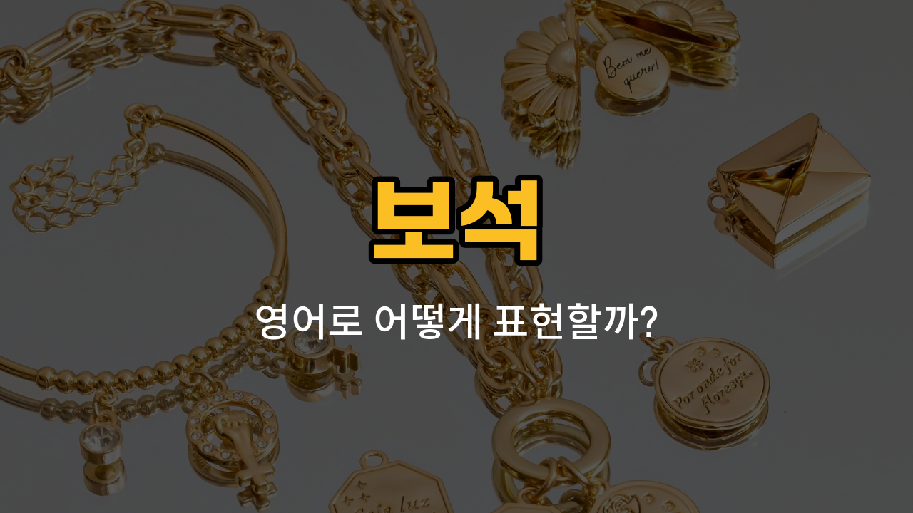

반짝반짝 빛나는 보석들은 영어로 어떻게 표현할까요? 오늘은 금(gold), 은(silver), 플래티넘(platinum), 옥수(opal), 터키석(turquoise) 등 대표적인 보석 이름의 영어 단어를 배워볼게요. 각 단어의 발음, 간단한 설명, 그리고 예문까지 함께 익혀보세요!

## 1. 금 (Gold)

금은 가장 유명하고 귀한 금속 중 하나로, 주로 장신구나 투자용으로 많이 사용돼요.

### 🗣️ 발음
- 발음기호: /goʊld/
- 한국어 발음: 골드

### 💭 관련 표현
- gold ring: 금반지
- gold necklace: 금목걸이
- [pure](/blog/in-english/427.pure/) gold: 순금

### 📝 예문으로 연습하기!

1. "She wears a gold ring every [day](/blog/in-english/1067.day/)."

   "그녀는 매일 금반지를 끼고 다녀요."

2. "Gold is a valuable metal."

   "금은 귀한 금속이에요."

## 2. 은 (Silver)

은은 밝은 회색 빛을 띠는 금속으로, 장신구나 식기류로 자주 사용돼요.

### 🗣️ 발음
- 발음기호: /ˈsɪlvər/
- 한국어 발음: 실버

### 💭 관련 표현
- silver bracelet: 은팔찌
- silver spoon: 은숟가락
- sterling silver: 순은

### 📝 예문으로 연습하기!

1. "My grandmother [gave](/blog/in-english/1407.gave/) me a silver necklace."

   "할머니가 저에게 은목걸이를 주셨어요."

2. "Silver is [often](/blog/in-english/326.often/) [used](/blog/in-english/171.used/) for jewelry."

   "은은 보석류에 자주 사용돼요."

## 3. 플래티넘 (Platinum)

플래티넘은 매우 희귀하고 단단한 금속으로, 고급 반지나 시계에 많이 쓰여요.

### 🗣️ 발음
- 발음기호: /ˈplætɪnəm/
- 한국어 발음: 플래티넘

### 💭 관련 표현
- platinum ring: 플래티넘 반지
- platinum watch: 플래티넘 시계
- pure platinum: 순수 플래티넘

### 📝 예문으로 연습하기!

1. "He bought a platinum wedding band."

   "그는 플래티넘 결혼반지를 샀어요."

2. "Platinum is more [expensive](/blog/in-english/317.expensive/) than gold."

   "플래티넘은 금보다 더 비싸요."

## 4. 옥수 (Opal)

옥수는 무지갯빛의 아름다운 색을 띠는 보석이에요. 빛에 따라 다양한 색으로 반짝여요.

### 🗣️ 발음
- 발음기호: /ˈoʊpəl/
- 한국어 발음: 오펄

### 💭 관련 표현
- opal ring: 옥수 반지
- opal pendant: 옥수 펜던트
- fire opal: 파이어 옥수

### 📝 예문으로 연습하기!

1. "She [loves](/blog/in-english/1074.love/) her opal earrings."

   "그녀는 자신의 옥수 귀걸이를 정말 좋아해요."

2. "Opal shines with many colors."

   "옥수는 여러 색으로 빛나요."

## 5. 터키석 (Turquoise)

터키석은 선명한 파란색이 특징인 보석으로, 행운을 가져다준다고도 해요.

### 🗣️ 발음
- 발음기호: /ˈtɜːrkwɔɪz/
- 한국어 발음: 터쿼이즈

### 💭 관련 표현
- turquoise necklace: 터키석 목걸이
- turquoise bracelet: 터키석 팔찌
- turquoise stone: 터키석 원석

### 📝 예문으로 연습하기!

1. "I bought a turquoise necklace in Turkey."

   "저는 터키에서 터키석 목걸이를 샀어요."

2. "Turquoise is my favorite gemstone."

   "터키석이 제가 가장 좋아하는 보석이에요."

---

오늘 배운 보석 이름들을 소리내어 따라해 보세요! 다음에 더 유용한 영어 단어로 찾아올게요~
