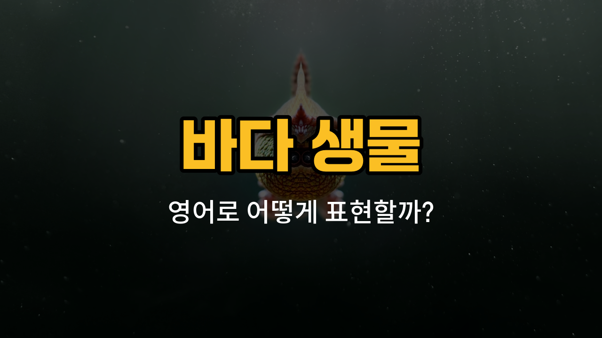

바다에는 정말 다양한 생물들이 살고 있어요. 오늘은 해파리, 불가사리, 가재, 조개, 소라처럼 바닷속에서 자주 볼 수 있는 바다 생물들의 영어 표현을 함께 배워볼 거예요. 각 단어의 발음, 간단한 설명, 그리고 예문까지 준비했으니 재미있게 따라와 주세요!

## 1. 해파리 (Jellyfish)

해파리는 투명한 몸과 긴 촉수를 가진 바다 생물이에요. 해수욕장에서 자주 볼 수 있어서 익숙하죠.

### 🗣️ 발음
- 발음기호: /ˈdʒɛl.iˌfɪʃ/
- 한국어 발음: 젤리피쉬

### 💭 관련 표현
- jellyfish sting: 해파리에 쏘임
- moon jellyfish: 무늬해파리

### 📝 예문으로 연습하기!

1. "I [saw](/blog/in-english/1371.saw/) a [big](/blog/in-english/1095.big/) jellyfish at the beach."

   "해변에서 큰 해파리를 봤어요."

2. "Be careful not to touch a jellyfish."

   "해파리를 만지지 않도록 조심해요."

## 2. 불가사리 (Starfish)

불가사리는 보통 다섯 개의 팔을 가진 별 모양의 바다 생물이에요.

### 🗣️ 발음
- 발음기호: /ˈstɑːrˌfɪʃ/
- 한국어 발음: 스타피쉬

### 💭 관련 표현
- sea [star](/blog/in-english/1557.star/): 불가사리(다른 이름)
- starfish arm: 불가사리의 팔

### 📝 예문으로 연습하기!

1. "The starfish was lying on a rock."

   "불가사리가 바위 위에 누워 있었어요."

2. "Have you ever touched a starfish?"

   "불가사리를 만져본 적 있어요?"

## 3. 가재 (Lobster)

가재는 큰 집게발이 특징인 바다 생물이에요. 식재료로도 자주 사용돼요.

### 🗣️ 발음
- 발음기호: /ˈlɑːb.stər/
- 한국어 발음: 랍스터

### 💭 관련 표현
- lobster claw: 가재의 집게발
- boiled lobster: 삶은 가재

### 📝 예문으로 연습하기!

1. "Lobster is a popular seafood in many [countries](/blog/in-english/1218.country/)."

   "가재는 많은 나라에서 인기 있는 해산물이에요."

2. "The lobster moved quickly across the sand."

   "가재가 모래 위를 빠르게 움직였어요."

## 4. 조개 (Clam)

조개는 단단한 껍데기 안에 살이 들어 있는 작은 바다 생물이에요.

### 🗣️ 발음
- 발음기호: /klæm/
- 한국어 발음: 클램

### 💭 관련 표현
- clam shell: 조개껍데기
- clam chowder: 조개 수프

### 📝 예문으로 연습하기!

1. "We [found](/blog/in-english/1083.find/) many clams on the beach."

   "해변에서 조개를 많이 찾았어요."

2. "Clam soup is delicious and healthy."

   "조개 수프는 맛있고 건강해요."

## 5. 소라 (Conch)

소라는 나선형 껍데기를 가진 바다 생물이에요. 껍데기 모양이 예뻐서 기념품으로도 인기가 많아요.

### 🗣️ 발음
- 발음기호: /kɒŋk/ 또는 /kɑːntʃ/
- 한국어 발음: 콘치

### 💭 관련 표현
- conch shell: 소라 껍데기
- conch salad: 소라 샐러드

### 📝 예문으로 연습하기!

1. "The conch shell made a [beautiful](/blog/in-english/1539.beautiful/) [sound](/blog/in-english/1278.sound/)."

   "소라 껍데기에서 아름다운 소리가 났어요."

2. "I saw a conch crawling on the ocean floor."

   "바닷속 바닥에서 소라가 기어가는 걸 봤어요."

---

오늘 배운 바다 생물 영어 단어와 예문을 소리 내어 따라 읽어보세요! 실제로 바다에 가거나 아쿠아리움에 갔을 때 이 단어들이 도움이 될 거예요. 다음에도 더 재미있는 영어 단어로 만나요~
