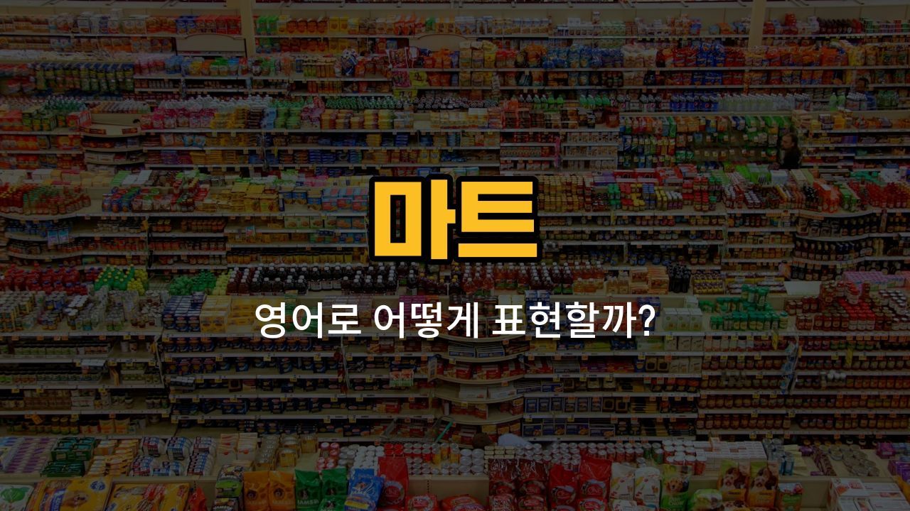

마트에서 자주 쓰는 영어 단어들을 배워볼까요? 오늘은 계산원, 상품, 진열대, 할인, 식료품과 관련된 영어 표현들을 알아보고, 실제 미국에서 쓰이는 자연스러운 예문도 함께 연습해볼 거예요. 마트에서 영어로 대화하거나, 해외여행 중 장을 볼 때 꼭 필요한 단어들이니 꼭 익혀두세요!

## 1. 계산원 (cashier)

계산원은 마트나 상점에서 손님이 산 물건의 값을 계산해주는 사람을 말해요.

### 🗣️ 발음

- 발음기호: /kæˈʃɪr/
- 한국어 발음: 캐쉬어

### 💭 관련 표현

- friendly cashier: 친절한 계산원
- cashier counter: 계산대

### 📝 예문으로 연습하기!

1. "The cashier smiled and [said](/blog/in-english/1061.said/) hello."

   "계산원이 웃으면서 인사했어요."

2. "I [paid](/blog/in-english/1323.pay/) for my items at the cashier."

   "계산원에게 내 물건 값을 지불했어요."

## 2. 상품 (product)

상품은 마트에서 판매하는 모든 물건을 뜻해요.

### 🗣️ 발음

- 발음기호: /ˈprɑː.dʌkt/
- 한국어 발음: 프러덕트

### 💭 관련 표현

- new product: 신상품
- popular product: 인기 상품

### 📝 예문으로 연습하기!

1. "This product is very popular with customers."

   "이 상품은 손님들에게 아주 인기가 많아요."

2. "I bought a new product at the store."

   "가게에서 새 상품을 샀어요."

## 3. 진열대 (shelf)

진열대는 마트에서 상품을 놓아두는 선반이나 칸을 말해요.

### 🗣️ 발음

- 발음기호: /ʃɛlf/
- 한국어 발음: 셸프

### 💭 관련 표현

- top shelf: 맨 위 진열대
- empty shelf: 빈 진열대

### 📝 예문으로 연습하기!

1. "The cookies are on the top shelf."

   "쿠키는 맨 위 진열대에 있어요."

2. "Some shelves are empty today."

   "오늘은 몇몇 진열대가 비어 있어요."

## 4. 할인 (discount)

할인은 상품의 가격을 깎아주는 것을 말해요. 세일과 비슷하지만, 할인은 가격이 내려간 상태를 더 많이 뜻해요.

### 🗣️ 발음

- 발음기호: /ˈdɪs.kaʊnt/
- 한국어 발음: 디스카운트

### 💭 관련 표현

- [big](/blog/in-english/1095.big/) discount: 큰 할인
- student discount: 학생 할인

### 📝 예문으로 연습하기!

1. "Is there a discount on this product?"

   "이 상품에 할인이 있나요?"

2. "I got a big discount during the [sale](/blog/in-english/1267.sale/)."

   "세일 기간에 큰 할인을 받았어요."

## 5. 식료품 (groceries)

식료품은 마트에서 사는 먹거리, 즉 음식 재료를 뜻해요. 예를 들어 우유, 달걀, 채소 등이 식료품이에요.

### 🗣️ 발음

- 발음기호: /ˈɡroʊ.sər.iz/
- 한국어 발음: 그로서리즈

### 💭 관련 표현

- buy [groceries](/blog/in-english/1502.grocery/): 식료품을 사다
- grocery store: 식료품점

### 📝 예문으로 연습하기!

1. "I need to buy groceries for the [week](/blog/in-english/1129.week/)."

   "이번 주를 위해 식료품을 사야 해요."

2. "She [carries](/blog/in-english/464.carry/) her groceries in a big bag."

   "그녀는 큰 가방에 식료품을 담아가요."

---

오늘 배운 단어와 예문을 여러 번 소리 내어 따라 해보세요. 마트에서 직접 사용할 수 있는 실용적인 표현들이니, 영어로 장 볼 때 꼭 활용해보세요! 다음에도 더 유용한 영어 단어로 돌아올게요~
