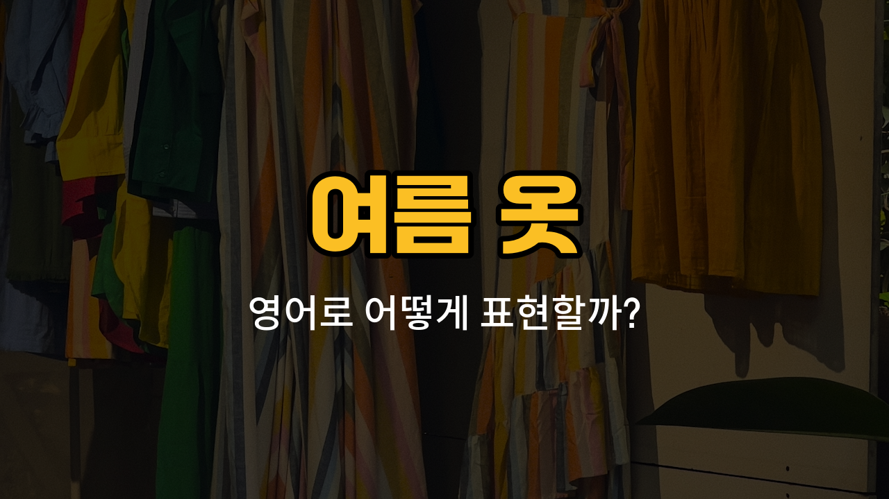

여름이 되면 시원하고 편안한 옷차림이 중요하죠! 오늘은 여름에 자주 입는 옷과 액세서리의 영어 표현을 배워볼 거예요. 실제로 많이 쓰이는 단어들과 예문을 통해 자연스럽게 영어 실력을 키워보세요.

## 1. 치마바지 (Skort)

치마처럼 보이지만 속에 반바지가 붙어 있어서 활동하기 편한 여름 옷이에요.

### 🗣️ 발음
- 발음기호: /skɔːrt/
- 한국어 발음: 스코트

### 💭 관련 표현
- tennis skort: 테니스용 치마바지
- casual skort: 캐주얼 치마바지

### 📝 예문으로 연습하기!
1. "She wore a skort to the picnic."

   "그녀는 소풍에 치마바지를 입었어요."

2. "A skort is comfortable for biking."

   "치마바지는 자전거 탈 때 편해요."

## 2. 민소매 원피스 (Sleeveless dress)

어깨 부분이 없는, 팔이 드러나는 시원한 여름 원피스예요.

### 🗣️ 발음
- 발음기호: /ˈsliːvləs drɛs/
- 한국어 발음: 슬리블러스 드레스

### 💭 관련 표현
- floral sleeveless dress: 꽃무늬 민소매 원피스
- cotton sleeveless dress: 면 민소매 원피스

### 📝 예문으로 연습하기!
1. "She [looks](/blog/in-english/1466.looks/) cool in a sleeveless dress."

   "그녀는 민소매 원피스를 입어서 시원해 보여요."

2. "I bought a new sleeveless dress for summer."

   "여름을 위해 새 민소매 원피스를 샀어요."

## 3. 수영복 (Swimsuit)

수영할 때 입는 옷으로, 바닷가나 수영장에서 꼭 필요해요.

### 🗣️ 발음
- 발음기호: /ˈswɪmˌsuːt/
- 한국어 발음: 스윔수트

### 💭 관련 표현
- one-piece swimsuit: 원피스 수영복
- two-piece swimsuit: 투피스 수영복

### 📝 예문으로 연습하기!
1. "Don’t [forget](/blog/in-english/023.forget/) your swimsuit for the pool."

   "수영장에 갈 때 수영복을 잊지 마세요."

2. "She bought a colorful swimsuit."

   "그녀는 알록달록한 수영복을 샀어요."

## 4. 햇빛가리개 모자 (Sun hat)

햇빛을 가려주는 넓은 챙이 있는 모자로, 야외 활동할 때 자주 써요.

### 🗣️ 발음
- 발음기호: /sʌn hæt/
- 한국어 발음: 선 햇

### 💭 관련 표현
- straw sun hat: 밀짚 햇빛가리개 모자
- wide-brimmed sun hat: 챙이 넓은 햇빛가리개 모자

### 📝 예문으로 연습하기!
1. "Wear a sun hat to protect your [face](/blog/in-english/1252.face/)."

   "얼굴을 보호하려면 햇빛가리개 모자를 써요."

2. "She [looks](/blog/in-english/1078.look/) stylish in her sun hat."

   "그녀는 햇빛가리개 모자를 써서 멋져 보여요."

## 5. 샌들 (Sandals)

발을 시원하게 해주는 여름 신발이에요. 발가락과 발등이 드러나서 통풍이 잘 돼요.

### 🗣️ 발음
- 발음기호: /ˈsændlz/
- 한국어 발음: 샌들즈

### 💭 관련 표현
- leather sandals: 가죽 샌들
- [flip](/blog/in-english/246.flip/)-flop sandals: 플립플랍 샌들

### 📝 예문으로 연습하기!
1. "I wear sandals every [day](/blog/in-english/1067.day/) in summer."

   "여름에는 매일 샌들을 신어요."

2. "Sandals are [perfect](/blog/in-english/413.perfect/) for the beach."

   "샌들은 해변에 딱이에요."

---

오늘 배운 여름 옷 영어 단어와 예문을 여러 번 소리내어 읽어보세요! 실제 상황에서 자연스럽게 쓸 수 있도록 연습하면 영어가 훨씬 쉬워질 거예요. 다음에도 더 유용한 영어 단어로 찾아올게요~
