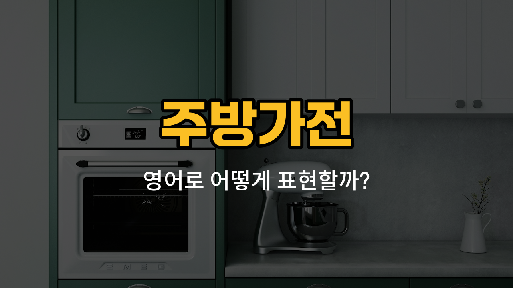

주방에서 자주 사용하는 가전제품들을 영어로 어떻게 말하는지 궁금하신가요? 오늘은 믹서, 커피포트, 제빵기, 냉동고, 정수기 등 실생활에서 꼭 필요한 주방가전 영어 단어를 함께 배워볼게요. 각 단어의 발음과 예문도 같이 익혀 보세요!

## 1. 믹서 (Mixer)

과일 주스나 스무디를 만들 때, 재료를 갈거나 섞을 때 쓰는 전기 기계예요.

### 🗣️ 발음
- 발음기호: /ˈmɪk.sɚ/
- 한국어 발음: 믹서

### 💭 관련 표현
- hand mixer: 핸드 믹서
- stand mixer: 스탠드 믹서
- blender: (비슷하지만 주로 액체를 갈 때 쓰는 믹서)

### 📝 예문으로 연습하기!

1. "I [use](/blog/in-english/1079.use/) a mixer to make fruit juice."

   "저는 과일 주스를 만들 때 믹서를 사용해요."

2. "Can you [help](/blog/in-english/1084.help/) me [clean](/blog/in-english/523.clean/) the mixer?"

   "믹서 청소 좀 도와줄 수 있어요?"

## 2. 커피포트 (Electric pot)

물을 빠르게 끓일 때 쓰는 전기 주전자예요. 커피나 차를 마실 때 자주 사용해요.

### 🗣️ 발음
- 발음기호: /ɪˈlɛk.trɪk pɑːt/
- 한국어 발음: 일렉트릭 팟

### 💭 관련 표현
- electric kettle: 전기 주전자
- boil water: 물을 끓이다

### 📝 예문으로 연습하기!

1. "Please fill the electric pot with water."

   "커피포트에 물을 채워주세요."

2. "The electric pot boils water very quickly."

   "커피포트는 물을 아주 빨리 끓여줘요."

## 3. 제빵기 (Bread maker)

집에서 빵을 직접 만들 수 있게 도와주는 기계예요. 재료만 넣으면 자동으로 반죽하고 구워줘요.

### 🗣️ 발음
- 발음기호: /brɛd ˈmeɪ.kɚ/
- 한국어 발음: 브레드 메이커

### 💭 관련 표현
- make bread: 빵을 만들다
- homemade bread: 집에서 만든 빵

### 📝 예문으로 연습하기!

1. "My mom uses a bread maker every weekend."

   "우리 엄마는 주말마다 제빵기를 사용해요."

2. "The bread maker [makes](/blog/in-english/1209.makes/) fresh bread in the [morning](/blog/in-english/1351.morning/)."

   "제빵기가 아침마다 신선한 빵을 만들어줘요."

## 4. 냉동고 (Freezer)

음식이나 재료를 오래 보관하기 위해 얼려두는 가전제품이에요.

### 🗣️ 발음
- 발음기호: /ˈfriː.zɚ/
- 한국어 발음: 프리저

### 💭 관련 표현
- [deep](/blog/in-english/428.deep/) freezer: 대형 냉동고
- freeze: 얼리다

### 📝 예문으로 연습하기!

1. "We keep ice cream in the freezer."

   "아이스크림은 냉동고에 보관해요."

2. "The freezer is full of frozen [food](/blog/in-english/1308.food/)."

   "냉동고가 냉동식품으로 가득 차 있어요."

## 5. 정수기 (Water purifier)

물을 깨끗하게 걸러주는 기계예요. 집이나 사무실에서 맑은 물을 마실 수 있게 해줘요.

### 🗣️ 발음
- 발음기호: /ˈwɔː.t̬ɚ ˈpjʊr.əˌfaɪ.ɚ/
- 한국어 발음: 워터 퓨리파이어

### 💭 관련 표현
- clean water: 깨끗한 물
- filter: 걸러내다

### 📝 예문으로 연습하기!

1. "We installed a water purifier in the kitchen."

   "주방에 정수기를 설치했어요."

2. "The water purifier needs a new filter."

   "정수기는 새 필터가 필요해요."

---

오늘 배운 주방가전 영어 단어와 예문을 여러 번 소리 내어 읽어보세요! 실제 생활에서 영어로 말할 때 훨씬 자연스럽게 활용할 수 있을 거예요. 다음에도 더 유용한 영어 단어로 다시 만나요~
