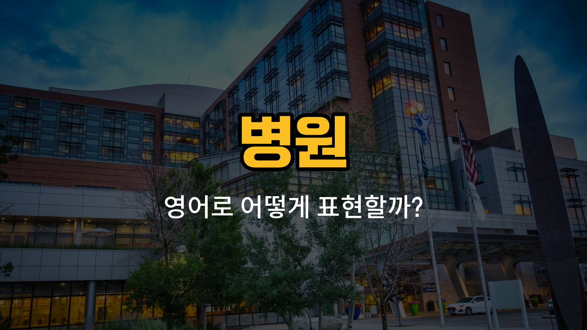

병원에 가면 자주 듣게 되는 영어 단어들을 알아볼게요! 오늘은 약국, 접수처, 진찰실, 대기실, 진료과와 관련된 영어 표현과 예문을 준비했어요. 각 단어의 발음, 뜻, 그리고 실제로 쓸 수 있는 예문까지 함께 공부해봐요.

## 1. 약국 (Pharmacy)

약을 사고 처방전을 제출하는 곳이에요.

### 🗣️ 발음
- 발음기호: /ˈfɑːrməsi/
- 한국어 발음: 파머씨

### 💭 관련 표현
- pharmacy counter: 약국 카운터
- [prescription](/blog/in-english/566.prescription/) pharmacy: 처방전 약국
- [local](/blog/in-english/1260.local/) pharmacy: 동네 약국

### 📝 예문으로 연습하기!

1. "I need [to go](/blog/in-english/450.to-go/) to the pharmacy to get my medicine."

   "약을 받으러 약국에 가야 해요."

2. "Is there a pharmacy near the hospital?"

   "병원 근처에 약국이 있나요?"

## 2. 접수처 (Reception desk)

병원에 들어가면 처음 방문해서 안내를 받거나 접수를 하는 곳이에요.

### 🗣️ 발음
- 발음기호: /rɪˈsɛpʃən dɛsk/
- 한국어 발음: 리셉션 데스크

### 💭 관련 표현
- hospital reception desk: 병원 접수처
- main reception desk: 메인 접수처

### 📝 예문으로 연습하기!

1. "Please [check](/blog/in-english/1358.check/) in at the reception desk when you arrive."

   "도착하면 접수처에서 접수해 주세요."

2. "The reception desk is on the first floor."

   "접수처는 1층에 있어요."

## 3. 진찰실 (Consultation room)

의사 선생님과 진료를 받는 방이에요.

### 🗣️ 발음
- 발음기호: /ˌkɑːnsəlˈteɪʃən ruːm/
- 한국어 발음: 컨설테이션 룸

### 💭 관련 표현
- doctor's consultation [room](/blog/in-english/1490.room/): 의사 진찰실
- private consultation room: 개인 진찰실

### 📝 예문으로 연습하기!

1. "The doctor will see you in the consultation room."

   "의사 선생님이 진찰실에서 진료해 주실 거예요."

2. "Please wait here until you are called into the consultation room."

   "진찰실로 불릴 때까지 여기서 기다려 주세요."

## 4. 대기실 (Waiting room)

진료를 기다리거나 보호자가 대기하는 공간이에요.

### 🗣️ 발음
- 발음기호: /ˈweɪtɪŋ ruːm/
- 한국어 발음: 웨이팅 룸

### 💭 관련 표현
- hospital waiting room: 병원 대기실
- [family](/blog/in-english/1100.family/) waiting room: 가족 대기실

### 📝 예문으로 연습하기!

1. "Please have a seat in the waiting room."

   "대기실에 앉아서 기다려 주세요."

2. "The waiting room was full of [patients](/blog/in-english/562.patient/)."

   "대기실이 환자들로 가득했어요."

## 5. 진료과 (Department)

병원에서 각기 다른 진료를 담당하는 과를 의미해요. 예를 들어 내과, 외과, 소아과 등이 있어요.

### 🗣️ 발음
- 발음기호: /dɪˈpɑːrtmənt/
- 한국어 발음: 디파트먼트

### 💭 관련 표현
- pediatrics department: 소아과
- cardiology department: 심장내과
- surgery department: 외과

### 📝 예문으로 연습하기!

1. "Which department do you need to visit?"

   "어느 진료과에 방문하셔야 하나요?"

2. "The dermatology department is on the third floor."

   "피부과는 3층에 있어요."

---

오늘 배운 병원 관련 영어 단어와 예문을 소리 내어 따라 읽어보세요! 실제 병원에 갈 때나 영어로 안내를 받을 때 큰 도움이 될 거예요. 다음에도 실생활에 꼭 필요한 영어 단어들로 찾아올게요!
