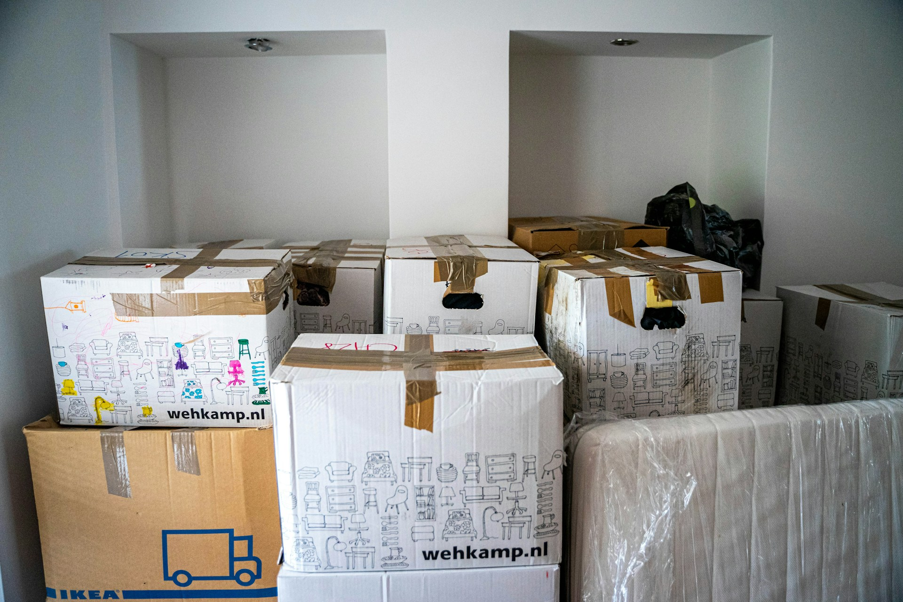

## 🌟 영어 표현 - take up

안녕하세요! 👋 오늘은 영어로 **'시작하다', '착수하다', '차지하다'** 라는 의미를 가진 **"take up"** 표현에 대해 알아볼게요.

"take up"은 일상생활에서 다양한 상황에서 사용되는 표현이에요. **주로 새로운 취미나 활동을 시작할 때, 또는 공간이나 시간을 차지한다는 의미로 사용**되죠. 🎯 이 두 의미는 서로 연관지어 생각해볼 수 있어요. 새로운 취미나 활동을 시작하면 자연스럽게 우리의 시간과 공간을 차지하게 되니까요.

예를 들어, 새로운 취미를 시작할 때 이렇게 말할 수 있어요. "I decided to take up yoga this year." (올해 요가를 시작하기로 했어요.) 또는 공간을 차지할 때는 "This sofa takes up too much space." (이 소파가 너무 많은 공간을 차지해요.) 라고 표현할 수 있답니다!

"take up"은 시간을 소비한다는 의미로도 쓰여요. 🕒 예를 들면, "The meeting took up all morning." (회의가 오전 시간을 모두 차지했어요.) 이렇게 말할 수 있죠.

<!-- engple-horizontal-ad -->

<ins class="adsbygoogle"
     style="display:block"
     data-ad-client="ca-pub-1465612013356152"
     data-ad-slot="2106896038"
     data-ad-format="auto"
     data-full-width-responsive="true"></ins>

## 📖 예문

"새로운 취미를 시작하고 싶어요."

"I want to take up a new hobby."

"이 프로젝트가 많은 시간을 차지할 거예요."

"This project will take up a lot of time."

자, 이제 "take up"을 사용한 다양한 예문을 살펴볼까요? 꼭 소리내어 말하면서 연습해보세요! 🚀

## 💬 연습해보기

올해 요가를 시작할 생각이에요.

I think I'll take up yoga this year.

그녀는 은퇴한 후에 그림을 시작했어요.

She took up painting after she retired.

너무 많은 공간을 차지하지 마세요 - 우리 모두 차에 들어가야 해요.

Don't take up too much space - we need to fit everyone in the car.

이 상자들이 제 옷장 공간의 대부분을 차지하고 있어요.

These boxes take up most of my closet space.

요즘 새로운 취미 때문에 여가 시간이 하나도 없네요.

My new hobby has taken up all my free time lately.

새로 산 소파가 거실 절반이나 차지하네요!

The new couch takes up half the living room!

이 프로젝트가 생각보다 시간이 훨씬 더 많이 걸리네요.

This project's taking up way more time than I expected.

아이들 장난감이 지하실을 완전히 점령해버렸네요.

The kids' toys take up the entire basement now.

주말까지 일에 빼앗기지 마세요.

Don't let work take up all your weekends.

## 🤝 함께 알아두면 좋은 표현들

### take on

'take on'은 **"맡다" 또는 "도전하다"** 라는 의미예요. **새로운 책임이나 일을 수용하거나, 어려운 과제에 도전**하는 것을 나타내요. 주로 능동적이고 긍정적인 태도를 강조할 때 사용해요.

"After much consideration, he [decided to](/blog/in-english/062.decide-to/) [take on](/blog/vocab-1/033.take-on/) the role of team leader."

"많은 고민 끝에 그는 팀 리더 역할을 맡기로 결정했습니다."

### put off

'put off'는 **"미루다" 또는 "연기하다"** 라는 뜻이에요. 어떤 일을 **나중으로 미루거나 지연시키는 상황**을 나타내며, 주로 부정적인 이유로 인해 즉시 행동하지 않을 때 사용해요.

"I had to [put off](/blog/in-english/180.put-off/) my vacation plans due to unexpected work commitments."

"예상치 못한 업무로 인해 휴가 계획을 미뤄야 했습니다."

---

오늘은 **'시작하다', '차지하다'** 의 의미를 전달하는 **'take up'** 에 대해 배워봤어요. 정말 유용한 표현이죠? 일상 대화에서 자주 사용해보세요. 여러분의 영어 실력이 한층 더 업그레이드될 거예요! 😉

다음에 또 유용한 표현으로 찾아올게요!
